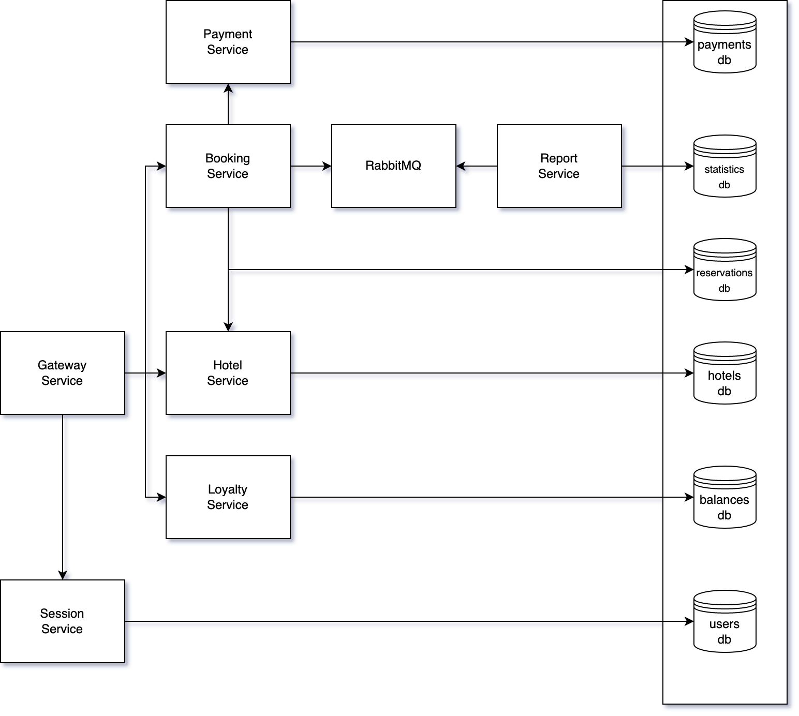
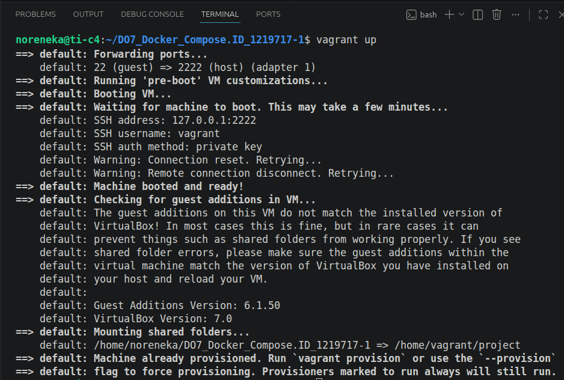
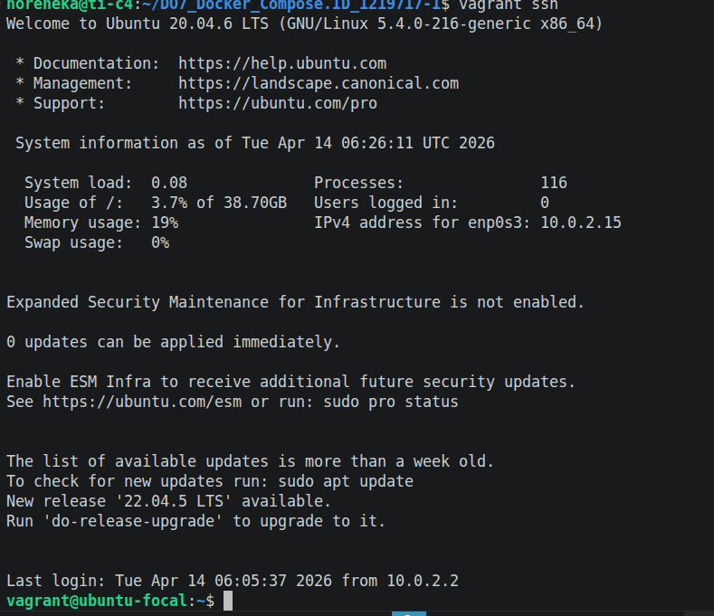
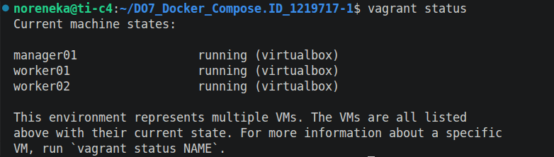
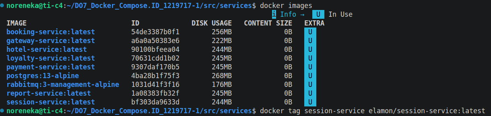
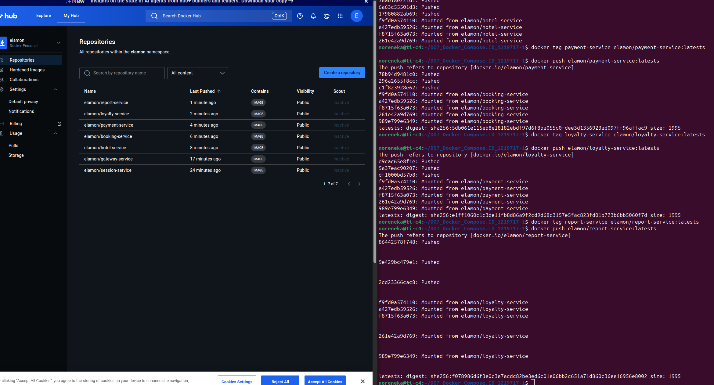
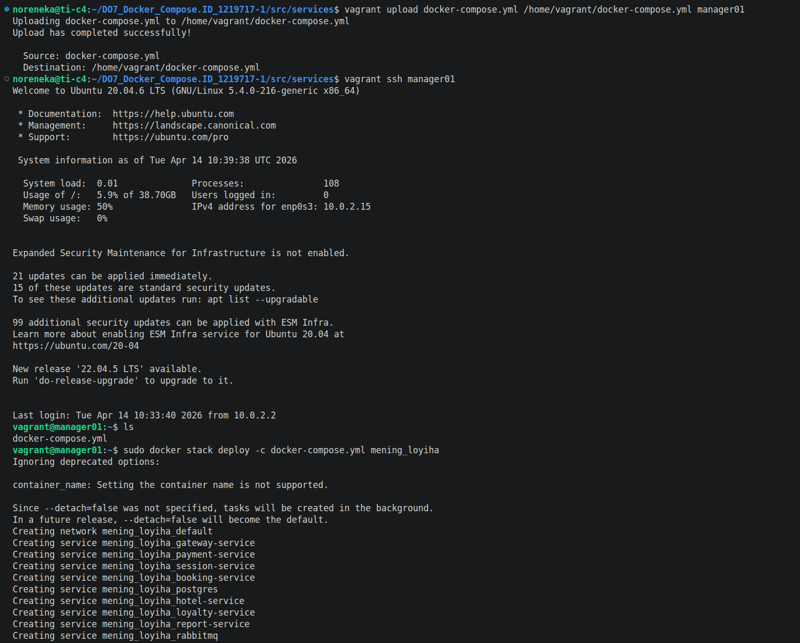
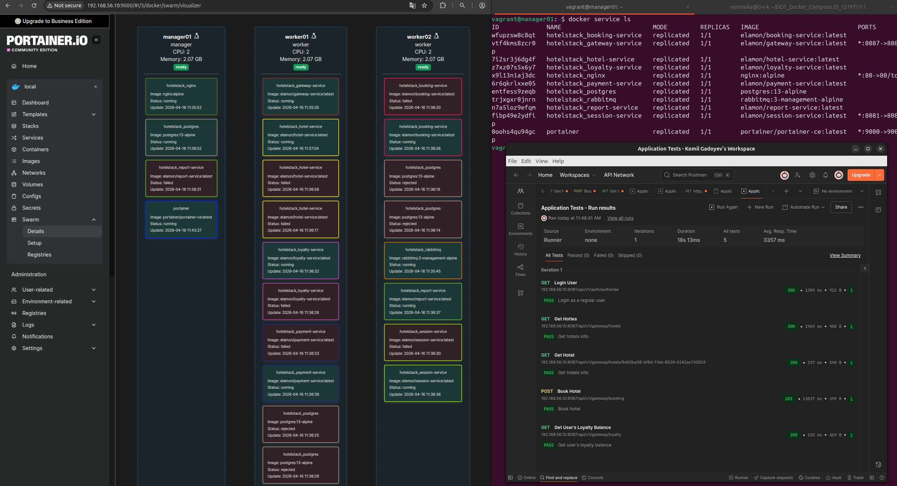

## 🏨 Hotel Booking Microservices Deployment
\
Ushbu loyiha 9 ta mikroservisdan iborat mehmonxona xonalarini band qilish tizimini Docker yordamida konteynerlashtirish va deploy qilishga bag'ishlangan.

## 🏗 Arxitektura va Tuzilish
Loyiha Java (JDK 8) tilida yozilgan backend xizmatlaridan tashkil topgan:

Gateway Service — Barcha so'rovlar uchun kirish nuqtasi.

Microservices — Session, Hotel, Payment, Loyalty, Report va Booking xizmatlari.

Infratuzilma — PostgreSQL ma'lumotlar bazasi va RabbitMQ xabarlar navbati.

## 🐳 Dockerizatsiya Strategiyasi
Loyiha samaradorligini oshirish uchun quyidagi usullar qo'llanildi:

Multi-stage Build: Obraz hajmini kamaytirish uchun qurish va ishga tushirish bosqichlari ajratildi.

Alpine Base Images: OS darajasidagi ortiqcha fayllarni cheklash uchun **bellsoft/liberica-openjdk-alpine:8** obrazidan foydalanildi.

Layer Optimization: Maven kutubxonalarini keshlashtirish orqali build vaqti optimallashtirildi.
Loyiha konfiguratsiyasini ko'rish uchun [bu yerni bosing](./services/session-service/Dockerfile).

## 📊 Obrazlar hajmi tahlili (Image Size Analysis)
Obrazlar o'lchamini aniqlash uchun **docker images**, **docker inspect** va **docker history** metodlaridan foydalanildi.

## 📊 Obrazlar o'lchami tahlili
Hisobotda har bir servis hajmi tahlil qilindi:

| Servis Nomi        | Hajmi (MB) | Metod           | Holati      |
|:-------------------|:-----------|:----------------|:------------|
| Gateway Service    | 220 MB     | docker images   | ✅ Tayyor    |
| Session Service    | 242 MB     | docker images   | ✅ Tayyor    |
| Report  service    | 243 MB     | docker inspect  | ✅ Tayyor    |
| Hotel   service    | 242 MB     |                 |              |
| Booking service    | 254 MB     |                 |              |
| Loyalty service    | 243 MB     |                 |              |
| Payment service    | 243 MB     |                 |              |

\
\
\
izoh: **docker** buyrugi natijasi.

\
\
**docker-compose up -d**   natijasi, barcha kontainerlar va veb xizmatlar mavjudligi.
Loyiha konfiguratsiyasini ko'rish uchun [bu yerni bosing](./services/docker-compose.yml).

## 🧪 3. Postman Test Natijalari
Backend funksionalligini tekshirish uchun Postman Runner orqali integratsion testlar o'tkazildi. Barcha so'rovlar muvaffaqiyatli amalga oshirildi.
\
**Test Xulosasi:**
* **Jami testlar:** 5 ta.
* **Muvaffaqiyatli:** 5 ta (100%).
* **O'rtacha javob vaqti:** 1427 ms.

### Batafsil natijalar:
| Test Case                 | Metod | Endpoint (Port 8087)          | Natija      |
|:--------------------------|:------|:------------------------------|:------------|
| **Login User** | GET   | `/api/v1/auth/authorize`      | ✅ 200 OK   |
| **Get Hotels** | GET   | `/api/v1/gateway/hotels`      | ✅ 200 OK   |
| **Get Hotel Detail** | GET   | `/api/v1/gateway/hotels/{id}` | ✅ 200 OK   |
| **Book Hotel** | POST  | `/api/v1/gateway/booking`     | ✅ 201 Created|
| **Get Loyalty Balance** | GET   | `/api/v1/gateway/loyalty`     | ✅ 200 OK   |

---

## 2-qism. Virtual mashinalarni yaratish.

Ushbu hisobot loyihani bitta izolyatsiya qilingan virtual mashinada (VM) joylashtirish, manba kodlarini sinxronizatsiya qilish va Vagrant vositasi orqali infratuzilmani boshqarish jarayonini tavsiflaydi.
\
izox: **vagrant** o'rnatildi.
---

## 🏗 1. Vagrant Muhitini Sozlash
Loyihaning ildiz (root) katalogida virtual muhitni yaratish uchun quyidagi qadamlar bajarildi:

1. **Vagrantfile yaratish:** Loyiha ildizida bitta virtual mashina konfiguratsiyasini belgilovchi `Vagrantfile` shakllantirildi **vagrant init** buyrug'i bilan.
2. **Operatsion tizim:** Baza obraz sifatida `ubuntu/focal64` tanlandi.
\

---

## 📁 2. Manba Kodlarini Ko'chirish (Sync Folders)
Veb-xizmatning manba kodlari virtual mashina ichidagi ishchi katalogga (`/vagrant` ) avtomatik ravishda nusxalandi.

* **Konfiguratsiya:** `config.vm.synced_folder ".", "/home/vagrant/project"` buyrug'i orqali mahalliy kodlar VM ichidagi katalog bilan bog'landi.
* **Maqsad:** Bu usul mahalliy xostda kodni tahrirlash va natijani darhol VM ichida ko'rish imkonini beradi.

---

## 💻 3. Konsol orqali Tekshirish va Boshqarish
Virtual mashinaning ishlashini va fayllar ko'chirilganligini tasdiqlash uchun quyidagi terminal buyruqlari bajarildi:

\
**VMni ishga tushirish:**
   ```bash
   vagrant up
   ```

\
**Virtual mashina ichiga kirish (ssh):**
   ```bash
   vagrant ssh
   ```

\
**Kodlar nusxalanganini tekshirish**
   ```bash
   ls
   ```

\
**Chiqish va o'chirish**
  ```bash
exit 

vagrant halt

vagrant destroy -f

vagrant status
```

## 3-qism 🌐 Docker Swarm va Mikroservislar Steki

Ushbu hisobot Vagrant orqali uchta tugundan iborat Docker Swarm klasterini yaratish, xizmatlarni stek ko'rinishida joylashtirish va Nginx proksi-serveri orqali xavfsizlikni ta'minlash jarayonlarini qamrab oladi.

---

## 🏗 1. Infratuzilmani Avtomatlashtirish (Vagrant & Shell)
Vagrant yordamida uchta virtual mashina (manager01, worker01, worker02) yaratildi. Har bir tugun uchun Dockerni avtomatik o'rnatish va Swarm klasterini shakllantirish uchun Shell skriptlari qo'llanildi.\

* **Cluster Status:**
    * `manager01` — Leader (Menejer)
    * `worker01` — Active (Ishchi)
    * `worker02` — Active (Ishchi)\
Loyiha konfiguratsiyasini ko'rish uchun [bu yerni bosing(Vagrantfile)](/Vagrantfile)\
[bu yerni bosing(install_docker.sh)](/install_docker.sh)\
[bu yerni bosing(setup_swarm.sh)](/setup_swarm.sh)
---

## 📦 2. Docker Hub va Stack Deployment
Barcha mikroservis obrazlari optimallashtirildi va **Docker Hub**ga yuklandi. `docker-compose.yml` fayli Docker Stack formatiga moslashtirilib, `manager01` tugunida ishga tushirildi.\
\
\

* **Stekni ishga tushirish:** `docker stack deploy -c docker-compose.yml mening_loyiha `
* **Obrazlar manbasi:** Docker Hub (Public/Private Registry)\
Loyiha konfiguratsiyasini ko'rish uchun [bu yerni bosing](./services/docker-compose.yml).
---

## 🛡 3. Nginx Proksi-server va Xavfsizlik
Tizim xavfsizligini ta'minlash uchun **Overlay Network** (ustki tarmoq) yaratildi. \
Loyiha konfiguratsiyasini ko'rish uchun [bu yerni bosing](./services/nginx.conf).
* **Nginx Gateway:** Faqat Nginx proksi-serveri tashqi portga (80) ochildi.
* **Izolyatsiya:** `gateway` va `session` xizmatlari to'g'ridan-to'g'ri tashqaridan ulanib bo'lmaydigan qilib yopildi. Barcha so'rovlar Nginx orqali ichki overlay tarmog'i bo'ylab yo'naltirildi.

---


### Tugunlar bo'yicha konteynerlar taqsimoti:
\
`docker stack ps` buyrug'i natijasiga ko'ra, konteynerlar quyidagicha taqsimlandi:

| Servis Nomi | Obraz (Image) | Tugun (Node) | Holati |
| :--- | :--- | :--- | :--- |
| **nginx-proxy** | nginx:alpine | manager01 | ✅ Running |
| **gateway-service** | elamon/gateway-service | manager01 | ✅ Running |
| **booking-service** | elamon/booking-service | manager01 | ✅ Running |
| **postgres-db** | postgres:13-alpine | manager01 | ✅ Running |
| **session-service** | elamon/session-service | worker01 | ✅ Running |
| **report-service** | elamon/report-service | worker02 | ✅ Running |

*Kuzatuv: Swarm menejeri resurslarni boshqarish maqsadida xizmatlarni avtomatik ravishda qayta tayinladi va barqaror holatga keltirdi.*

---

## 🖥 5. Portainer Visualizer
Klaster ichiga alohida **Portainer** steki o'rnatildi. Portainer orqali tugunlar va ish yuklamalarini vizual monitoring qilish imkoniyati yaratildi.

* **Portainer UI:** Tugunlar bo'ylab resurslar sarfi va konteynerlar statusi vizual tarzda tasdiqlandi.

---
\
## 🧪 6. Postman Integratsion Test Natijalari
Nginx proksi-serveri orqali barcha API endpointlar test qilindi. Natijalar barcha xizmatlarning o'zaro overlay tarmog'ida muvaffaqiyatli aloqa qilayotganini ko'rsatdi.

| Test Case                 | Method | Gateway (via Nginx) | Result      |
|:--------------------------|:------|:--------------------|:------------|
| Auth & Session check      | GET   | /api/v1/auth        | ✅ 200 OK   |
| Hotel Listing             | GET   | /api/v1/hotels      | ✅ 200 OK   |
| Booking Transaction       | POST  | /api/v1/booking     | ✅ 201 Created|

**Xulosa:** Barcha 5 ta test 100% muvaffaqiyatli o'tdi. To'g'ridan-to'g'ri xizmatlarga kirish bloklandi, bu esa infratuzilma xavfsizligini tasdiqlaydi.

# Docker, Docker Compose, Vagrant va Docker Swarm loyihasida ishlatilgan buyruqlar hisoboti

## 1. Docker image build qilish

### Docker image yaratish

```bash
docker build -t session-service .
```

Izoh:

* `docker build` — Docker image yaratadi.
* `-t session-service` — image nomini `session-service` qilib beradi.
* `.` — joriy papkadagi Dockerfile asosida build qiladi.

---

### Barcha servislar uchun image build qilish

```bash
docker build -t hotel-service .
docker build -t booking-service .
docker build -t payment-service .
docker build -t loyalty-service .
docker build -t report-service .
docker build -t gateway-service .
```

Izoh:

* Har bir servis uchun alohida Docker image yaratiladi.
* Build har bir servis papkasida bajariladi.

---

## 2. Docker image'larni tekshirish

```bash
docker images
```

Izoh:

* Local Docker image ro'yxatini ko'rsatadi.
* Repository nomi, tag, image ID va hajmini ko'rsatadi.

---

## 3. Docker container ishga tushirish

```bash
docker run -p 8081:8081 session-service
```

Izoh:

* `docker run` — image asosida container yaratadi va ishga tushiradi.
* `-p 8081:8081` — host portini container portiga bog'laydi.

---

## 4. Maven wrapper yaratish

```bash
mvn -N wrapper:wrapper
```

Izoh:

* Maven Wrapper fayllarini qayta yaratadi.
* `.mvn/wrapper/maven-wrapper.jar` muammoli bo'lsa ishlatiladi.

---

## 5. Maven dependency yuklash

```bash
./mvnw dependency:go-offline
```

Izoh:

* Maven dependency'larini oldindan yuklaydi.
* Docker build tezroq ishlashi uchun foydali.

---

## 6. Maven project package qilish

```bash
./mvnw package -DskipTests
```

Izoh:

* Loyihani build qiladi.
* `-DskipTests` testlarni o'tkazib yuboradi.
* Natijada `target/*.jar` fayl yaratiladi.

---

## 7. Docker Compose ishga tushirish

```bash
docker-compose up -d
```

Izoh:

* `docker-compose.yml` fayldagi barcha servislarni ishga tushiradi.
* `-d` — background rejimda ishlatadi.

---

## 8. Docker Compose to'xtatish

```bash
docker-compose down
```

Izoh:

* Compose orqali yaratilgan barcha containerlarni to'xtatadi va o'chiradi.

---

## 9. Docker containerlarni ko'rish

```bash
docker ps
```

Izoh:

* Hozir ishlayotgan containerlar ro'yxatini ko'rsatadi.

---

### Barcha containerlarni ko'rish

```bash
docker ps -a
```

Izoh:

* To'xtagan containerlarni ham ko'rsatadi.

---

## 10. Container loglarini ko'rish

```bash
docker logs session-service
```

Izoh:

* Container ichidagi loglarni ko'rsatadi.
* Xatoliklarni topishda foydali.

---

## 11. Vagrant virtual machine yaratish

```bash
vagrant up
```

Izoh:

* Vagrantfile asosida virtual mashinalarni yaratadi va ishga tushiradi.

---

## 12. Virtual machine ichiga kirish

```bash
vagrant ssh manager01
```

Izoh:

* `manager01` nomli VM ichiga kiradi.

---

### Worker node ichiga kirish

```bash
vagrant ssh worker01
vagrant ssh worker02
```

---

## 13. Virtual machine holatini ko'rish

```bash
vagrant status
```

Izoh:

* Barcha VM holatini ko'rsatadi.

---

## 14. Virtual machine o'chirish

```bash
vagrant halt
```

Izoh:

* VMlarni to'xtatadi.

---

### VMlarni butunlay o'chirish

```bash
vagrant destroy -f
```

Izoh:

* Virtual mashinalarni to'liq o'chiradi.

---

## 15. Docker Swarm manager yaratish

```bash
docker swarm init --advertise-addr 192.168.56.10
```

Izoh:

* Manager node yaratadi.
* `192.168.56.10` manager IP manzili.

---

## 16. Worker node'larni Swarm'ga qo'shish

```bash
docker swarm join --token TOKEN 192.168.56.10:2377
```

Izoh:

* Worker node Swarm klasterga qo'shiladi.
* TOKEN manager tomonidan beriladi.

---

## 17. Swarm node'larni ko'rish

```bash
docker node ls
```

Izoh:

* Manager va worker node ro'yxatini ko'rsatadi.

---

## 18. Docker Hub login qilish

```bash
docker login
```

Izoh:

* Docker Hub akkauntiga login qiladi.

---

## 19. Docker image tag qilish

```bash
docker tag session-service elamon/session-service:latest
```

Izoh:

* Local image'ga Docker Hub nomi beradi.

---

## 20. Docker image push qilish

```bash
docker push elamon/session-service:latest
```

Izoh:

* Image'ni Docker Hub'ga yuklaydi.

---

## 21. Docker stack deploy qilish

```bash
docker stack deploy -c docker-compose.yml hotelstack
```

Izoh:

* Docker Compose fayl asosida Swarm stack yaratadi.
* `hotelstack` stack nomi.

---

## 22. Docker service'larni ko'rish

```bash
docker service ls
```

Izoh:

* Swarm ichidagi barcha service'larni ko'rsatadi.

---

## 23. Stack ichidagi tasklarni ko'rish

```bash
docker stack ps hotelstack
```

Izoh:

* Har bir service qaysi node'da ishlayotganini ko'rsatadi.

---

## 24. Service loglarini ko'rish

```bash
docker service logs hotelstack_session-service
```

Izoh:

* Swarm service loglarini ko'rsatadi.

---

## 25. Stackni o'chirish

```bash
docker stack rm hotelstack
```

Izoh:

* Stack ichidagi barcha service'larni o'chiradi.

---

## 26. Portainer o'rnatish

```bash
docker service create \
  --name portainer \
  --publish 9000:9000 \
  --constraint 'node.role == manager' \
  --mount type=bind,src=/var/run/docker.sock,dst=/var/run/docker.sock \
  --mount type=volume,src=portainer_data,dst=/data \
  portainer/portainer-ce:latest
```

Izoh:

* Portainer web interface yaratadi.
* Manager node'da ishlaydi.
* `9000` port orqali browser'da ochiladi.

---

## 27. IP manzilni tekshirish

```bash
ip a
```

Izoh:

* Tarmoq interfeyslarini va IP manzillarni ko'rsatadi.

---

## 28. SCP orqali fayl ko'chirish

```bash
scp docker-compose.yml vagrant@192.168.56.10:/home/vagrant/
```

Izoh:

* Local faylni manager VM ichiga yuboradi.

---

## 29. Curl orqali API tekshirish

```bash
curl http://192.168.56.10/api
```

Izoh:

* Gateway yoki Nginx orqali API ishlayotganini tekshiradi.

---

## 30. Nginx reverse proxy vazifasi

Nginx quyidagi maqsadlarda ishlatildi:

* Session-service va gateway-service'ni yashirish
* Tashqi foydalanuvchilar faqat Nginx portiga ulanadi
* Ichki servislar faqat Docker overlay network orqali ishlaydi
* Reverse proxy sifatida so'rovlarni kerakli servisga yuboradi

Misol:

* `/auth/` → session-service
* `/api/` → gateway-service
* `/hotels/` → hotel-service

---

## 31. Docker Swarm nima qiladi

Docker Swarm quyidagi vazifalarni bajaradi:

* Bir nechta serverni bitta klasterga birlashtiradi
* Containerlarni turli node'larda avtomatik joylashtiradi
* Bir servis ishlamay qolsa boshqasini qayta ishga tushiradi
* Yuklamani node'lar orasida taqsimlaydi
* High availability beradi

---

## 32. Orchestrator tushunchasi

Orchestrator — container va servislarni boshqaradigan tizim.

Misollar:

* Docker Swarm
* Kubernetes
* Nomad

Vazifalari:

* Containerlarni ishga tushirish
* Restart qilish
* Scaling qilish
* Tarmoqni boshqarish
* Node'lar orasida taqsimlash

---

## 33. Loyiha yakunida ishlagan asosiy texnologiyalar

* Docker
* Docker Compose
* Docker Swarm
* Vagrant
* VirtualBox
* Nginx
* Portainer
* PostgreSQL
* RabbitMQ
* Spring Boot
* Maven
* Docker Hub
