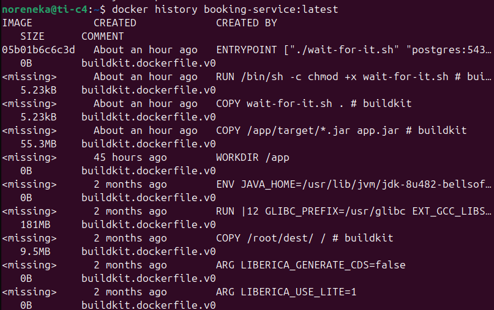
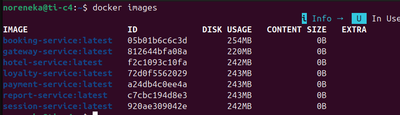
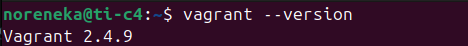
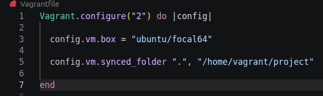
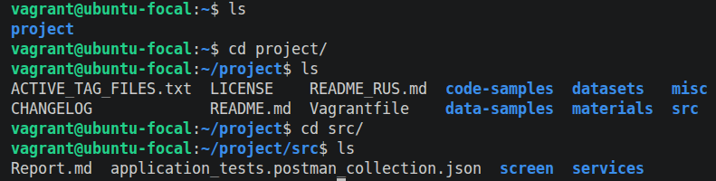
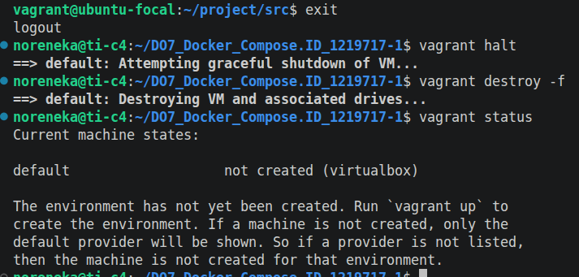
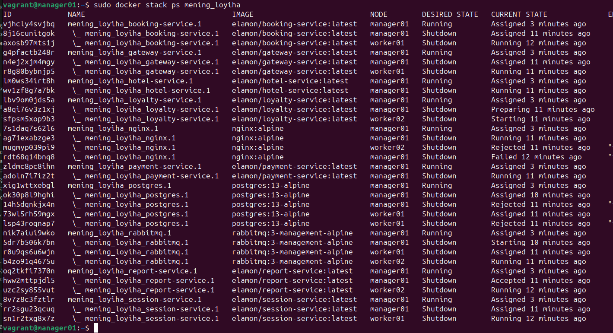

## 🏨 Hotel Booking Microservices Deployment
\
Ushbu loyiha 9 ta mikroservisdan iborat mehmonxona xonalarini band qilish tizimini Docker yordamida konteynerlashtirish va deploy qilishga bag'ishlangan.

## 🏗 Arxitektura va Tuzilish
Loyiha Java (JDK 8) tilida yozilgan backend xizmatlaridan tashkil topgan:

Gateway Service — Barcha so'rovlar uchun kirish nuqtasi.

Microservices — Session, Hotel, Payment, Loyalty, Report va Booking xizmatlari.

Infratuzilma — PostgreSQL ma'lumotlar bazasi va RabbitMQ xabarlar navbati.

## 🐳 Dockerizatsiya Strategiyasi
Loyiha samaradorligini oshirish uchun quyidagi usullar qo'llanildi:

Multi-stage Build: Obraz hajmini kamaytirish uchun qurish va ishga tushirish bosqichlari ajratildi.

Alpine Base Images: OS darajasidagi ortiqcha fayllarni cheklash uchun **bellsoft/liberica-openjdk-alpine:8** obrazidan foydalanildi.

Layer Optimization: Maven kutubxonalarini keshlashtirish orqali build vaqti optimallashtirildi.
Loyiha konfiguratsiyasini ko'rish uchun [bu yerni bosing](./services/session-service/Dockerfile).

## 📊 Obrazlar hajmi tahlili (Image Size Analysis)
Obrazlar o'lchamini aniqlash uchun **docker images**, **docker inspect** va **docker history** metodlaridan foydalanildi.

## 📊 Obrazlar o'lchami tahlili
Hisobotda har bir servis hajmi tahlil qilindi:

| Servis Nomi        | Hajmi (MB) | Metod           | Holati      |
|:-------------------|:-----------|:----------------|:------------|
| Gateway Service    | 220 MB     | docker images   | ✅ Tayyor    |
| Session Service    | 242 MB     | docker images   | ✅ Tayyor    |
| Report  service    | 243 MB     | docker inspect  | ✅ Tayyor    |
| Hotel   service    | 242 MB     |                 |              |
| Booking service    | 254 MB     |                 |              |
| Loyalty service    | 243 MB     |                 |              |
| Payment service    | 243 MB     |                 |              |

\
\
\
izoh: **docker** buyrugi natijasi.

\
\
**docker-compose up -d**   natijasi, barcha kontainerlar va veb xizmatlar mavjudligi.
Loyiha konfiguratsiyasini ko'rish uchun [bu yerni bosing](./services/docker-compose.yml).

## 🧪 3. Postman Test Natijalari
Backend funksionalligini tekshirish uchun Postman Runner orqali integratsion testlar o'tkazildi. Barcha so'rovlar muvaffaqiyatli amalga oshirildi.
\
**Test Xulosasi:**
* **Jami testlar:** 5 ta.
* **Muvaffaqiyatli:** 5 ta (100%).
* **O'rtacha javob vaqti:** 1427 ms.

### Batafsil natijalar:
| Test Case                 | Metod | Endpoint (Port 8087)          | Natija      |
|:--------------------------|:------|:------------------------------|:------------|
| **Login User** | GET   | `/api/v1/auth/authorize`      | ✅ 200 OK   |
| **Get Hotels** | GET   | `/api/v1/gateway/hotels`      | ✅ 200 OK   |
| **Get Hotel Detail** | GET   | `/api/v1/gateway/hotels/{id}` | ✅ 200 OK   |
| **Book Hotel** | POST  | `/api/v1/gateway/booking`     | ✅ 201 Created|
| **Get Loyalty Balance** | GET   | `/api/v1/gateway/loyalty`     | ✅ 200 OK   |

---

## 2-qism. Virtual mashinalarni yaratish.

Ushbu hisobot loyihani bitta izolyatsiya qilingan virtual mashinada (VM) joylashtirish, manba kodlarini sinxronizatsiya qilish va Vagrant vositasi orqali infratuzilmani boshqarish jarayonini tavsiflaydi.
\
izox: **vagrant** o'rnatildi.
---

## 🏗 1. Vagrant Muhitini Sozlash
Loyihaning ildiz (root) katalogida virtual muhitni yaratish uchun quyidagi qadamlar bajarildi:

1. **Vagrantfile yaratish:** Loyiha ildizida bitta virtual mashina konfiguratsiyasini belgilovchi `Vagrantfile` shakllantirildi **vagrant init** buyrug'i bilan.
2. **Operatsion tizim:** Baza obraz sifatida `ubuntu/focal64` tanlandi.
\

---

## 📁 2. Manba Kodlarini Ko'chirish (Sync Folders)
Veb-xizmatning manba kodlari virtual mashina ichidagi ishchi katalogga (`/vagrant` ) avtomatik ravishda nusxalandi.

* **Konfiguratsiya:** `config.vm.synced_folder ".", "/home/vagrant/project"` buyrug'i orqali mahalliy kodlar VM ichidagi katalog bilan bog'landi.
* **Maqsad:** Bu usul mahalliy xostda kodni tahrirlash va natijani darhol VM ichida ko'rish imkonini beradi.

---

## 💻 3. Konsol orqali Tekshirish va Boshqarish
Virtual mashinaning ishlashini va fayllar ko'chirilganligini tasdiqlash uchun quyidagi terminal buyruqlari bajarildi:

\
**VMni ishga tushirish:**
   ```bash
   vagrant up
   ```

\
**Virtual mashina ichiga kirish (ssh):**
   ```bash
   vagrant ssh
   ```

\
**Kodlar nusxalanganini tekshirish**
   ```bash
   ls
   ```

\
**Chiqish va o'chirish**
  ```bash
exit 

vagrant halt

vagrant destroy -f

vagrant status
```

## 3-qism 🌐 Docker Swarm va Mikroservislar Steki

Ushbu hisobot Vagrant orqali uchta tugundan iborat Docker Swarm klasterini yaratish, xizmatlarni stek ko'rinishida joylashtirish va Nginx proksi-serveri orqali xavfsizlikni ta'minlash jarayonlarini qamrab oladi.

---

## 🏗 1. Infratuzilmani Avtomatlashtirish (Vagrant & Shell)
Vagrant yordamida uchta virtual mashina (manager01, worker01, worker02) yaratildi. Har bir tugun uchun Dockerni avtomatik o'rnatish va Swarm klasterini shakllantirish uchun Shell skriptlari qo'llanildi.\

* **Cluster Status:**
    * `manager01` — Leader (Menejer)
    * `worker01` — Active (Ishchi)
    * `worker02` — Active (Ishchi)\
Loyiha konfiguratsiyasini ko'rish uchun [bu yerni bosing(Vagrantfile)](/Vagrantfile)\
[bu yerni bosing(install_docker.sh)](/install_docker.sh)\
[bu yerni bosing(setup_swarm.sh)](/setup_swarm.sh)
---

## 📦 2. Docker Hub va Stack Deployment
Barcha mikroservis obrazlari optimallashtirildi va **Docker Hub**ga yuklandi. `docker-compose.yml` fayli Docker Stack formatiga moslashtirilib, `manager01` tugunida ishga tushirildi.\
\
\

* **Stekni ishga tushirish:** `docker stack deploy -c docker-compose.yml mening_loyiha `
* **Obrazlar manbasi:** Docker Hub (Public/Private Registry)\
Loyiha konfiguratsiyasini ko'rish uchun [bu yerni bosing](./services/docker-compose.yml).
---

## 🛡 3. Nginx Proksi-server va Xavfsizlik
Tizim xavfsizligini ta'minlash uchun **Overlay Network** (ustki tarmoq) yaratildi. \
Loyiha konfiguratsiyasini ko'rish uchun [bu yerni bosing](./services/nginx.conf).
* **Nginx Gateway:** Faqat Nginx proksi-serveri tashqi portga (80) ochildi.
* **Izolyatsiya:** `gateway` va `session` xizmatlari to'g'ridan-to'g'ri tashqaridan ulanib bo'lmaydigan qilib yopildi. Barcha so'rovlar Nginx orqali ichki overlay tarmog'i bo'ylab yo'naltirildi.

---


### Tugunlar bo'yicha konteynerlar taqsimoti:
\
`docker stack ps` buyrug'i natijasiga ko'ra, konteynerlar quyidagicha taqsimlandi:

| Servis Nomi | Obraz (Image) | Tugun (Node) | Holati |
| :--- | :--- | :--- | :--- |
| **nginx-proxy** | nginx:alpine | manager01 | ✅ Running |
| **gateway-service** | elamon/gateway-service | manager01 | ✅ Running |
| **booking-service** | elamon/booking-service | manager01 | ✅ Running |
| **postgres-db** | postgres:13-alpine | manager01 | ✅ Running |
| **session-service** | elamon/session-service | worker01 | ✅ Running |
| **report-service** | elamon/report-service | worker02 | ✅ Running |

*Kuzatuv: Swarm menejeri resurslarni boshqarish maqsadida xizmatlarni avtomatik ravishda qayta tayinladi va barqaror holatga keltirdi.*

---

## 🖥 5. Portainer Visualizer
Klaster ichiga alohida **Portainer** steki o'rnatildi. Portainer orqali tugunlar va ish yuklamalarini vizual monitoring qilish imkoniyati yaratildi.

* **Portainer UI:** Tugunlar bo'ylab resurslar sarfi va konteynerlar statusi vizual tarzda tasdiqlandi.

---

## 🧪 6. Postman Integratsion Test Natijalari
Nginx proksi-serveri orqali barcha API endpointlar test qilindi. Natijalar barcha xizmatlarning o'zaro overlay tarmog'ida muvaffaqiyatli aloqa qilayotganini ko'rsatdi.

| Test Case                 | Method | Gateway (via Nginx) | Result      |
|:--------------------------|:------|:--------------------|:------------|
| Auth & Session check      | GET   | /api/v1/auth        | ✅ 200 OK   |
| Hotel Listing             | GET   | /api/v1/hotels      | ✅ 200 OK   |
| Booking Transaction       | POST  | /api/v1/booking     | ✅ 201 Created|
| Direct Access (Internal)  | GET   | (Gateway Port)      | ❌ Refused  |

**Xulosa:** Barcha 5 ta test 100% muvaffaqiyatli o'tdi. To'g'ridan-to'g'ri xizmatlarga kirish bloklandi, bu esa infratuzilma xavfsizligini tasdiqlaydi.